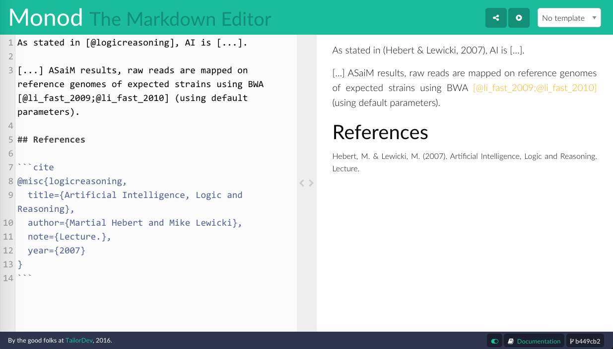
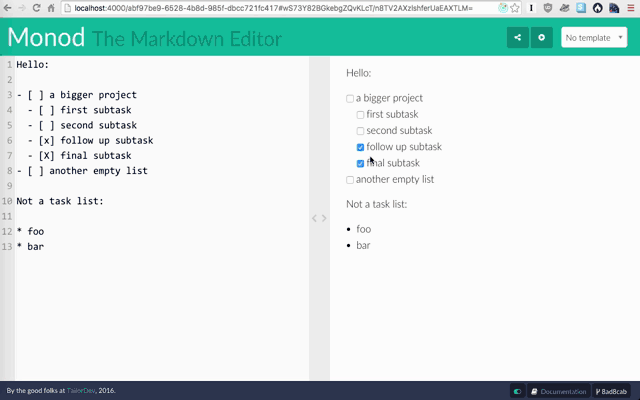

Writing Monod documents
=======================

Hi! Thanks for visiting the Monod documentation. In this part, you will learn
how to write awesome Monod documents by leveraging the
[Markdown](http://commonmark.org/help/) language, a text-based language used to
write content without polluting it too much with presentation, and many more
features!

* [Monod syntax](#monod-syntax)
* [YAML Front-Matter](#yaml-front-matter)
* [Templates](templates.md)


## Monod syntax

If you are new to Markdown, you should give [this 10-minute Markdown
tutorial](http://commonmark.org/help/tutorial/) a try. Monod supports CommonMark
(a strongly defined, highly compatible specification of Markdown). Because it
does not support HTML for security concerns, Monod provides various syntax
extensions.

* [Abbreviations](#abbreviations)
* [Autolinks](#autolinks)
* [BibTeX support](#bibtex-support)
* [Code](#code)
* [Emoji](#emoji)
* [highlighting](#highlighting)
* [Icons / FontAwesome](#icons--fontawesome)
* [Insertions](#insertions)
* [Mathematical expressions](#mathematical-expressions)
* [Small paragraphs](#small-paragraphs)
* [Strikethrough](#strikethrough)
* [Subscript](#subscript)
* [Superscript](#superscript)
* [Tables](#tables)
* [Task lists](#task-lists)


### Abbreviations

Abbreviations are used to enrich the content of your Monod documents thanks to
the [`<abbr>` HTML
tag](https://developer.mozilla.org/en-US/docs/Web/HTML/Element/abbr):

```
*[ABBR]: The description of ABBR

Some content where ABBR is mentioned.
```

Pay attention to the syntax: there is no space between `*` and `[`.

### Autolinks

In regular Markdown, links are usually written with the `[link
description](url)` syntax. In Monod, you can directly paste an URL in your
document, and it will be automatically transformed into a link.

### BibTeX support

Using [fenced code blocks](#code) (see the next section) à la GitHub, you can
add scientific references and citations into your Monod documents. Monod will
just render them nicely:



Use as many fenced `cite` code blocks as you wish to add citations, and use the
Pandoc `[@citation_ref]` syntax to add references to these citations (using the
citation "keys" or "references"):

    According to [@citation_ref], this is not accurate.

    ``` cite
    @article{citation_ref,
        ...
    }
    ```

In the screenshot above, the `[@logicreasoning]` reference points to the
citation in the fenced `cite` code block at the bottom of the document. Note
that you can put multiple `cite` blocks, and there is no specific position
(place them wherever you wish, but do not forget that they will be rendered
where you put them in the preview). It is recommended to put all your citations
in one single `cite` code block though (as you probably already do in your
`.bib` file).

The `[@li_fast_2009;@li_fast_2010]` reference contains two references, and it is
marked as invalid because Monod does not find any citation that corresponds to
any of the given references. With multiple references, only one not found
reference will mark the whole reference as invalid.

### Code

Code can be rendered with fenced code blocks:

    A Go interface looks like:

    ```
    interface {}
    ```

### Emoji

We support **emoji** too! :tada:

The syntax is similar to FontAwesome icons (as well as many emoji-friendly
applications like Slack or GitHub):

```
:tada:
```

Most of the existing emoji are listed on this cheat sheet:
http://www.emoji-cheat-sheet.com/.

### Highlighting

You can highlight text in yellow (à la [Stabilo Boss
Highlighter](https://en.wikipedia.org/wiki/Schwan-Stabilo) by surrounding your
content with `==`:

```
This is ==very important==
```

### Icons / FontAwesome

You can use [FontAwesome](http://fontawesome.io/) icons with the following
syntax, where `<icon name>` should be replaced with an actual icon name (_e.g._,
`check`):

```
:fa-<icon name>:
```

You can find the icon names at: http://fontawesome.io/icons/. Those icons are
scalable, which means you can use them anywhere (from titles to basic
paragraphs), and they will always be rendered nicely.

### Insertions

Insertions into a document can be highlighted in green by surrounding them with
`++`:

```
Hello. ++I have added this part++
```

### Mathematical expressions

Thanks to [KaTeX](https://khan.github.io/KaTeX/), Monod supports mathematical
expressions. Write LaTeX symbols into `$`:

```
A LTS is a 4-tuple $<Q,L,T,q_0>$.
```

### Small paragraphs

It is possible to write smaller content with the following syntax:

```
::: small
This is a smaller content than the rest of the document.
:::
```

### Strikethrough

You can strike through some content by surrounding it with `~~`:

```
This is ~~not~~ good.
```

### Subscript

You can write
[subscripts](https://developer.mozilla.org/en-US/docs/Web/HTML/Element/sub) by
surrounding your content with `~`:

```
H~2~O
```

### Superscript

You can write
[superscripts](https://developer.mozilla.org/en-US/docs/Web/HTML/Element/sup)
by surrounding your content with `^`:

```
^This is a superscript^ and this is not.
```

### Tables

Monod supports (data) tables:

```
| Tables   |      Are      |  Cool |
|----------|:-------------:|------:|
| col 1 is |  left-aligned | $1600 |
| col 2 is |    centered   |   $12 |
| col 3 is | right-aligned |    $1 |
```

Note that it is possible to choose column alignment by specifying `:` either on
the left, right or both sides of the horizontal separators.

### Task Lists

Task lists are lists with items marked as either `[ ]` or `[x]` (incomplete or
complete). For example:

```
- [ ] a task list item
  - [ ] a sub item
- [x] a task list item that is completed
```

This renders as a list of checkboxes. From here, you can either modify the
content of your Monod document, or directly check or uncheck the boxes in the
preview panel, and the text will automatically update:




## YAML Front-Matter

[YAML](http://yaml.org/) front-matter allows to add extra information (metadata)
to your documents, such as variables for the different templates. Monod expects
a unique (optional) YAML front-matter section starting at the first line of the
document and surrounded by three dashes (`---`):

```yaml
---
key: value
foo:
  bar: lol
---
```
